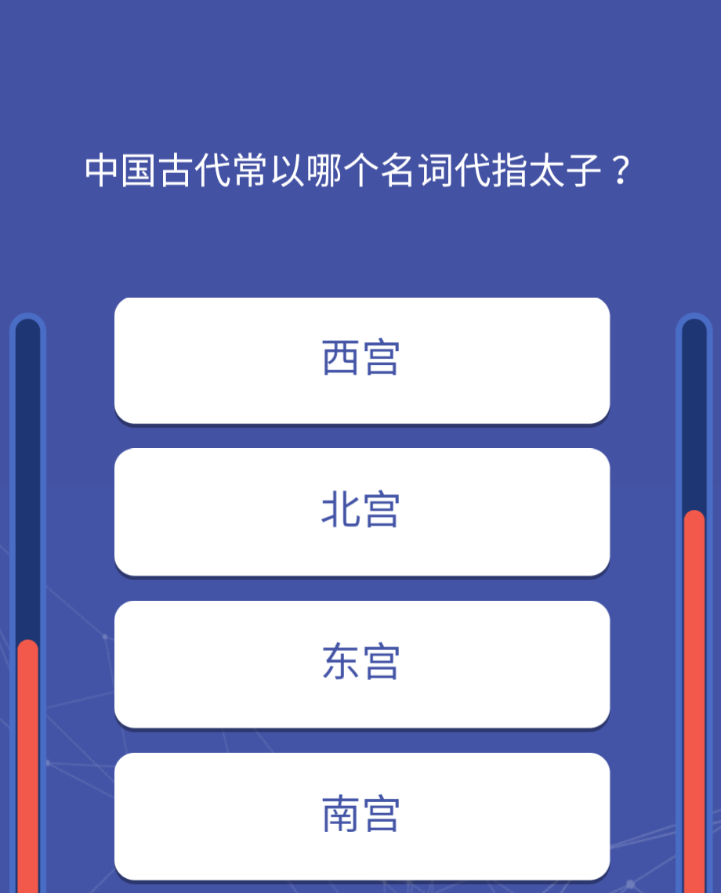
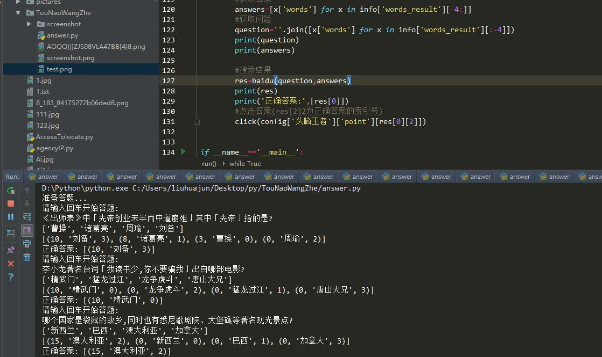

# Pylibrary
Pylibrary
##  py头脑王者自动答题  ##
最近比较火的头脑王者 冲顶大会  
#### 思路: 
* 1:利用adb截图到本地保存到内存中  
* 2:从内存中取出,并切取所需题目及答案部分并拼接到一张图 
* 3:文字识别
* 4:百度及谷歌搜索匹配最高的答案
* 5:adb模拟点击正确答案 
 

>注意：确保你手机连接电脑，并安装配置好adb 
>如果做好上述准备请打开你的游戏 当界面为答题的界面时 回车自动答题
